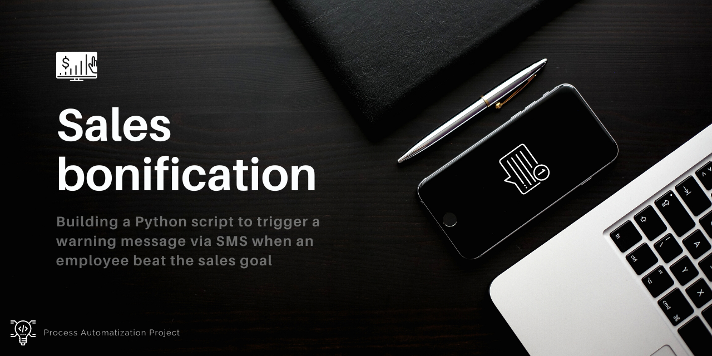

# mini-project-sales_warning
Building a program to trigger a warning message via SMS when an employee beaten the sales goal.

Imagine that your company has a database containing the names of employees and the total sales made in a specific month and you want to create a simple system for triggering messages, via SMS, when someone reaches the sales target. When an employee hits the sales target, he gets some bonus from the company. Using the Python language, we can build a simple, objective, and easily configure a system that allows the triggering of a warning via SMS when a condition is met. For the example of this mini-project, I defined that the hypothetical company's sales target is R$55,000. When the program identifies that an employee has reached the sale, a message will be triggered and an SMS will be sent to a specific number, which may be from the manager or area coordinator, for example. This type of automation can facilitate some processes within the company and can be adapted for different purposes, which can be extremely useful for decision-makers.

Click on the link to see more details: https://edugvs.github.io/mini-project-sales_warning/index.html

